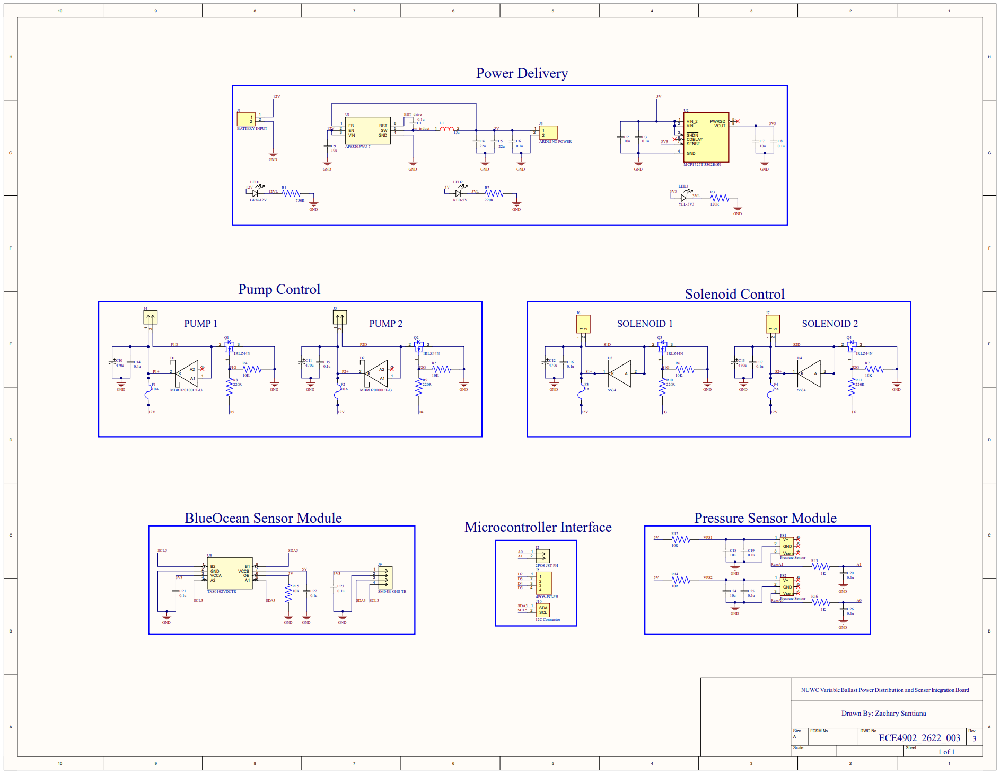
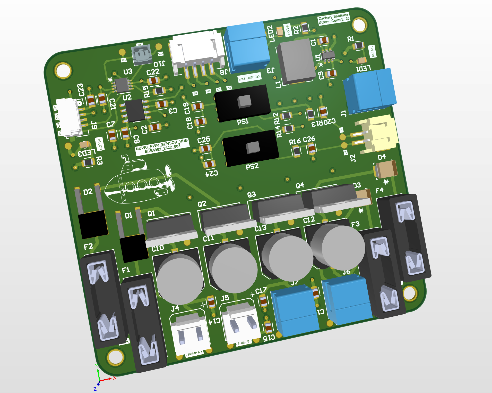
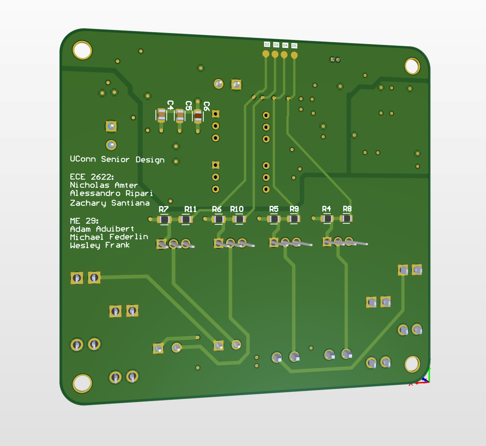

# UUV Power Sensor Hub PCB

This project is a 4-layer PCB designed as part of the University of Connecticut Senior Design program. Our team, ECE 2622, was assigned this project by the Naval Undersea Warfare Center (NUWC). The board provides power distribution and sensor interfacing for a variable ballasting system used in unmanned underwater vehicles (UUVs). The PCB is designed to connect to an off board Arduino Uno R3 running a PID loop to control pumps and solenoids which manage the inlet and outlet flow to adjust the depth of the vehicle.

## Schematic Overview

12V input is dropped to 5V with buck converter. An inductor of 6.8uH was selected due to the low current requirements of the digital components. A linear regulator is used to drop the 5V to 3V3, as the BlueOcean sensor communicates over I2C at 3V3. Proper bulk, decoupling and filtering capacitors have been added where necessary based on datasheet guidelines and recommended circuit calculations.

## Board Rendering

## Characteristics
The PCB is 3.2"x3" and 0805 components were used wherever possible to balance hand solderability and space constraints. All connectors are labeled with pinout information and are non-reversible.
- JST-PH 2 POS -> Analog signal from Pressure Sensors
- JST-PH 4 POS -> Digital input signal from Arduino
- Molex PicoBlade 2 POS -> I2C cable (3V3 and GND already connected)
- Overcurrent protection with fuses on each high current output and one main switch fuse
- High side MOSFET driver with flyback protection
- Terminal block headers, JST-PH, JST-GH, and Molex PicoBlade connectors used

## Layer Stack
1. Top Copper -> Signals and components
2. GND Plane -> No splits, signal reference voltage
3. PWR Plane -> Split 12V, 5V, 3V3 sections
4. Bottom Copper -> Signals and components
